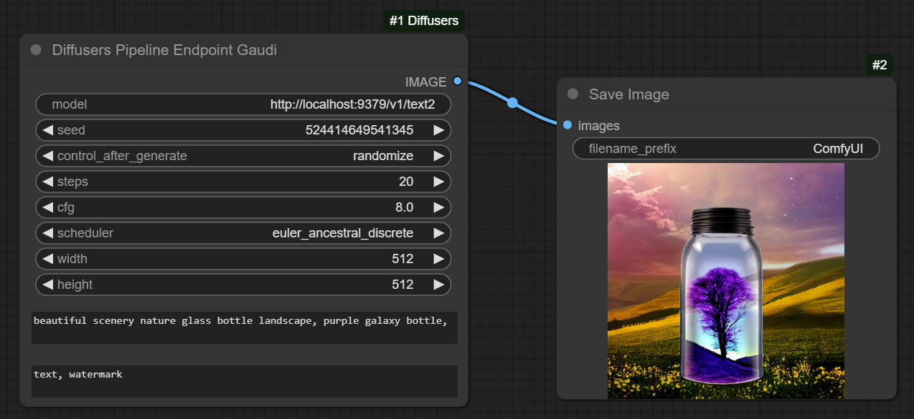
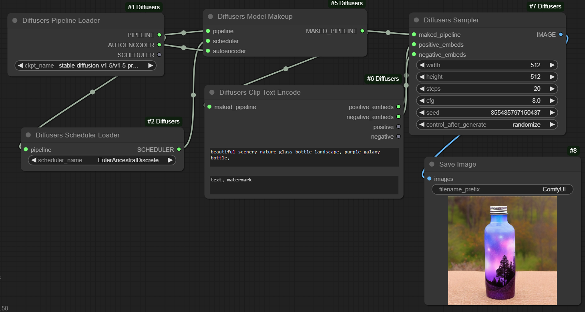
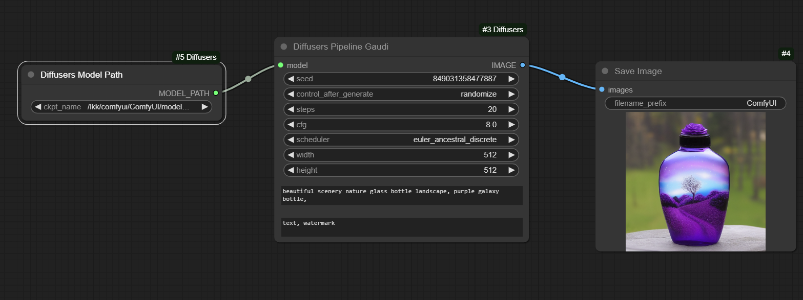
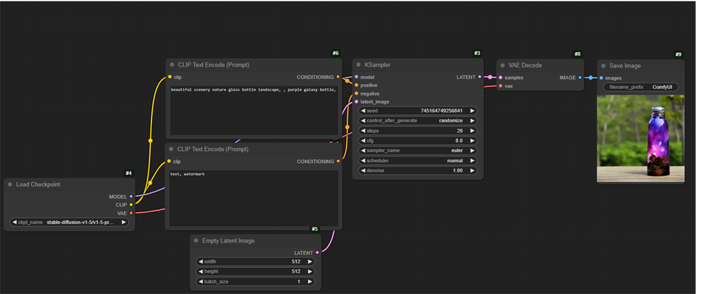

# ComfyUI-Diffusers-Habana

This repository is a custom node in ComfyUI.

This is a program that allows you to use Hugging Face `huggingface/optimum-habana/diffusers` module with ComfyUI, which can deploy stable diffusion models on Gaudi.

## Overview

### Workflow 1

### Workflow 2

### Workflow 3

### Workflow 4

## Usage

Put this repo inside ComfyUI/custom_nodes.

